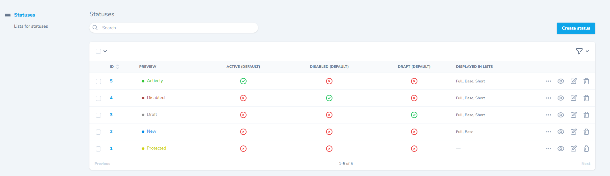
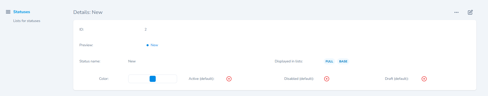
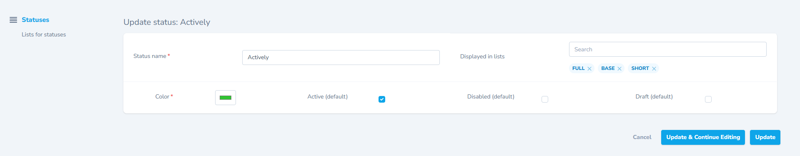
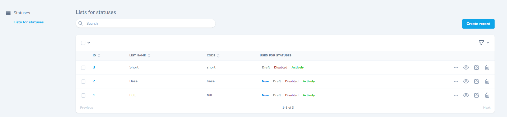

Плагин/Модуль/Пакет... Код - Унификация статусов для дальнейшего применения в своих пакетах.

# Установка

1. ```composer require mr-vaco/nova-statuses-manager```
2. ```php artisan vendor:publish --tag=mr_vaco__statuses```
3. ```php artisan migrate```

# Использование

- ```StatusClass::LIST('this_code_from_list')``` - Получение списка статусов по "code" параметру листа - по-умолчанию: full / base / short

- ```StatusClass::DEFAULT_ID()``` - объект - получить первый по ID статус

```php
StatusClass::DEFAULT_ID()->id
StatusClass::DEFAULT_ID()->name
StatusClass::DEFAULT_ID()->color
```

- ```StatusClass::ACTIVE()``` - объект - получить статус "активно" (по-умолчанию)

```php
StatusClass::ACTIVE()->id
StatusClass::ACTIVE()->name
StatusClass::ACTIVE()->color
```

- ```StatusClass::DISABLED()``` - объект - получить статус "отключено" (по-умолчанию)

```php
StatusClass::DISABLED()->id
StatusClass::DISABLED()->name
StatusClass::DISABLED()->color
```

- ```StatusClass::DRAFT()``` - объект - получить статус "черновик" (по-умолчанию)

```php
StatusClass::DRAFT()->id
StatusClass::DRAFT()->name
StatusClass::DRAFT()->color
```

- ```StatusClass::BY_ID($id)``` - объект - получить статус по ID

```php
StatusClass::BY_ID($id)->name
StatusClass::BY_ID($id)->color
```

### Использование в ресурсах Laravel Nova:

```php
use MrVaco\NovaStatusesManager\Classes\StatusClass;
use MrVaco\NovaStatusesManager\Fields\Status;

public function fields(NovaRequest $request): array
{
    return [
        Status::make(__('Status'), 'status')
            ->options(StatusClass::LIST('short'))
            ->default(StatusClass::ACTIVE()->id),
    ];
}
```





